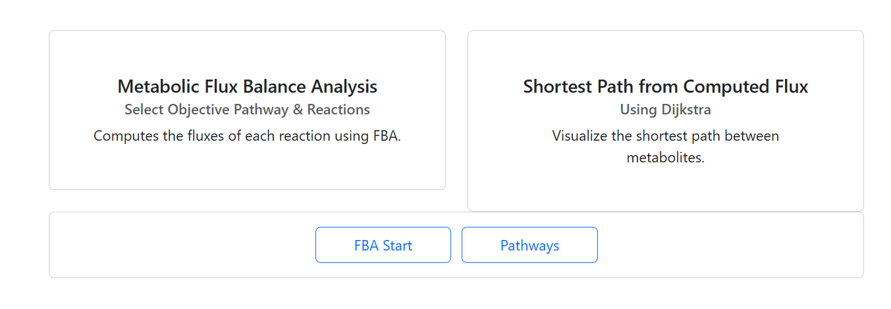
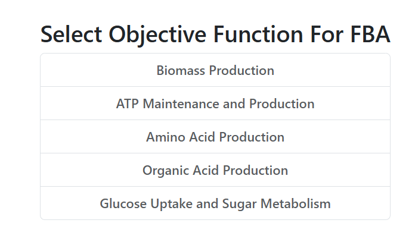
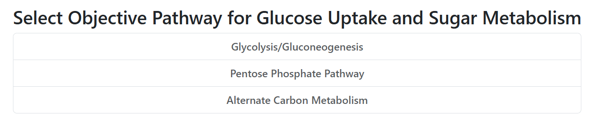
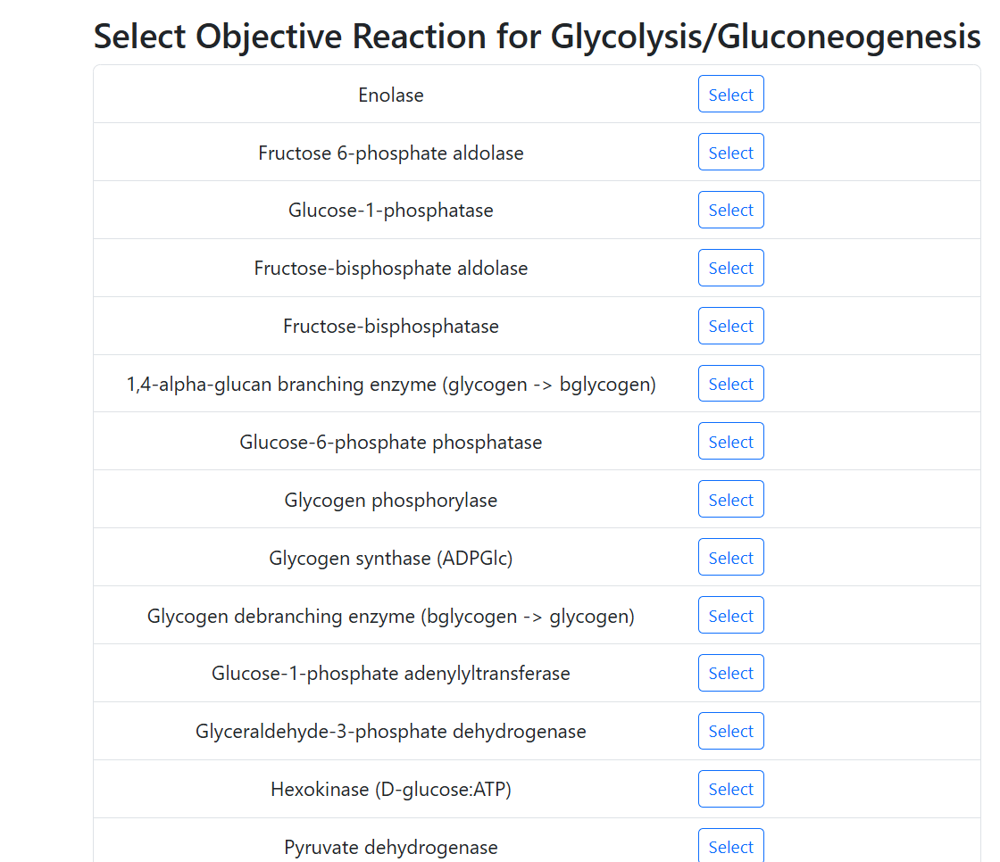
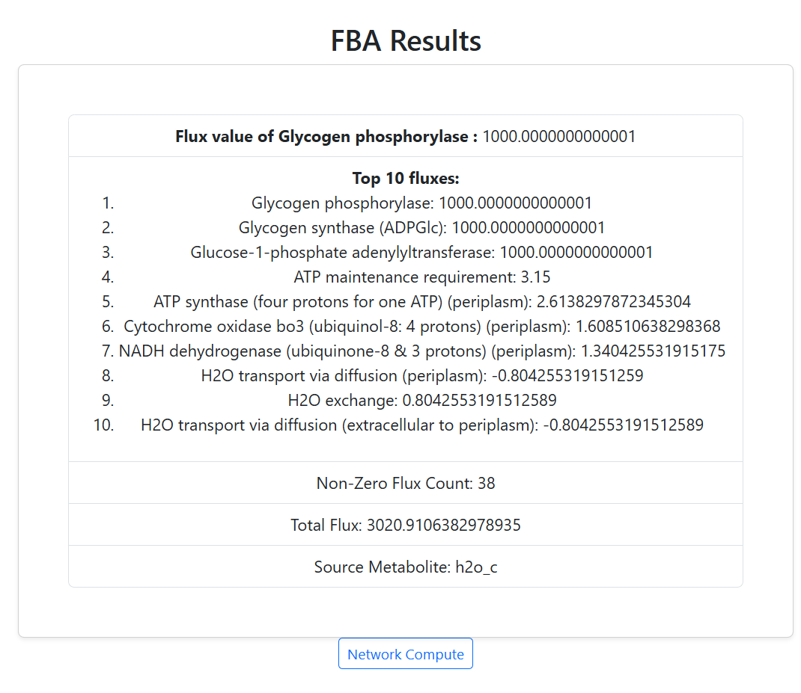
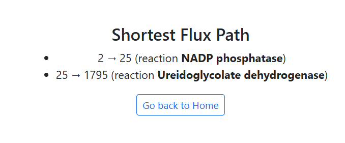

# 🧬 Metabolic Flux Pathway Visualizer (with FBA & Dijkstra)

A web-based tool for visualizing and analyzing metabolic flux pathways. Designed for **bioengineers** to identify optimal biological routes using **Flux Balance Analysis (FBA)** and **Dijkstra's algorithm**.

> Built with **Python 3**, **GraphQL**, **React**, and powered by **COBRApy** & **NetworkX**

---
## Features

- **Objective Reaction Selection**: Set a target reaction to optimize flux.
- **Flux Balance Analysis (FBA)**: Simulate metabolic networks using COBRApy.
- **Flux Visualization**: View top 10 flux reactions and system-level flux summary.
- **Shortest Path Search**: Use Dijkstra to find pathways between metabolites.
- **Substrate Suggestion**: Recommends meaningful source metabolites for optimization.

---

##  Tech Stack

**Backend**
- Python 3, FastAPI
- Strawberry GraphQL
- SQLAlchemy + SQLite
- COBRApy
- NetworkX

**Frontend**
- React + TypeScript
- Apollo Client
- React Bootstrap

---

##  System Architecture

###  Model & Database
- Loads [BiGG Model](http://bigg.ucsd.edu/) (e.g., `iJO1366` for *E. coli*)
- ~1800 reactions, ~1100 metabolites
- Seeded from JSON
- Async DB access via SQLAlchemy

### 🔬 FBA Logic (COBRApy)
- Objective reaction is set
- Runs `pfba()` (parsimonious FBA)
- Stores results in DB

```python
model.objective = rxn_id
solution = pfba(model)
for reaction_id, flux_value in solution.fluxes.items():
    # Store each flux in the database using mutation
    ...
    
    flux_type = FluxType(
                    id=flux_model.id,
                    value=flux_model.value,
                    flux_links=[
                        FluxReactionLinkType(
                            flux_id=flux_model.id,
                            reaction_id=reaction.id
                        )
                    ]
                )
                fluxInputs.append(flux_type)


 Dijkstra Algorithm (NetworkX)
Source = reactant, Target = product (from selected reaction)

Flux-weighted shortest path calculation


query GetReactionsByPathway($pathwayId: Int!) {
  reactionsByPathway(pathwayId: $pathwayId) {
    id
    entryId
    name
    equation
    subsystem
    fluxLinks {
      fluxId
    }
  }
}
```
## 🧪 Sample FBA Visualization

<p align="center">
  
  
  
  
  
   
</p>


---
## Folder Structure
```
.
├── Backend/
│   └── src/
│       ├── cobra_py/       # FBA logic with COBRApy
│       ├── database/       # SQLAlchemy models & DB session
│       ├── model/          # BiGG model JSON & loading utils
│       ├── mutation/       # GraphQL mutations (e.g., runFBA)
│       ├── network/        # Flux storing logic and Dijkstra shortest path algorithm
│       ├── query/          # GraphQL queries
│       ├── resolver/       # GraphQL resolver functions
│       ├── schema/         # Strawberry GraphQL schema definitions
│       ├── type/           # GraphQL types (ReactionType, FluxType, etc.)
│       ├── main.py         # FastAPI app entrypoint
│       ├── Dockerfile
│       ├── requirements.txt
│       ├── .nixpacks.toml
│       └── .dockerignore
│
├── frontend/
│   └── src/
│       ├── assets/         # Images, static files
│       ├── components/     # Reusable UI components
│       ├── graphql/        # Apollo Client queries/mutations
│       ├── pages/          # Page components (Home, FluxResults, etc.)
│       ├── App.tsx         # Main React component
│       ├── main.tsx        # React entrypoint
│       └── index.css
│


```

